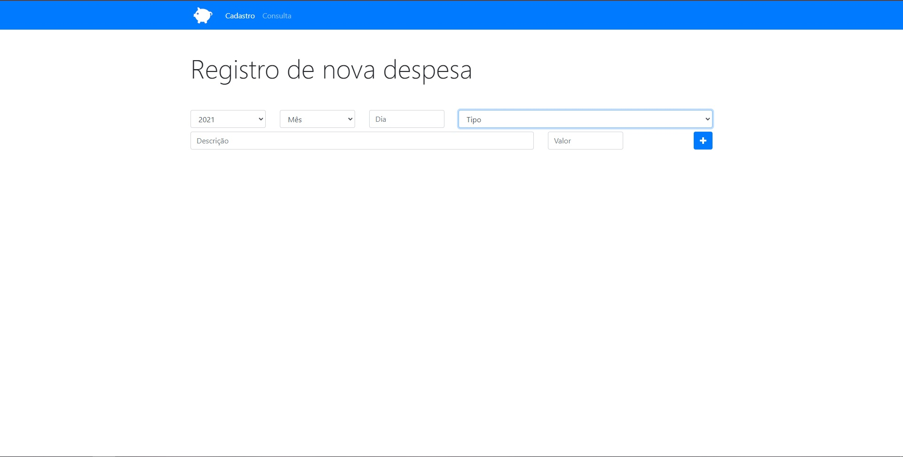

<h1 align="center"> Orçamento Pessoal </h1>

Seu aplicativo de controle financeiro!

 

  

## ✔ Tecnologias

Esse projeto foi desenvolvido com as seguintes tecnologias:

- HTML e BOOTSTRAP 4
- JavaScript
- Git e Github

## 💻 Projeto

Um aplicativo para gerir suas finanças, podendo adicionar novas despesas e classifica-las, além de consultar despesas cadastradas, filtra-las e ainda podendo excluí-las quando tiverem sido quitadas ou quando achar necessário!

- [Visite o projeto online] (https://patrickpicon.github.io/mata_mosquito/)
